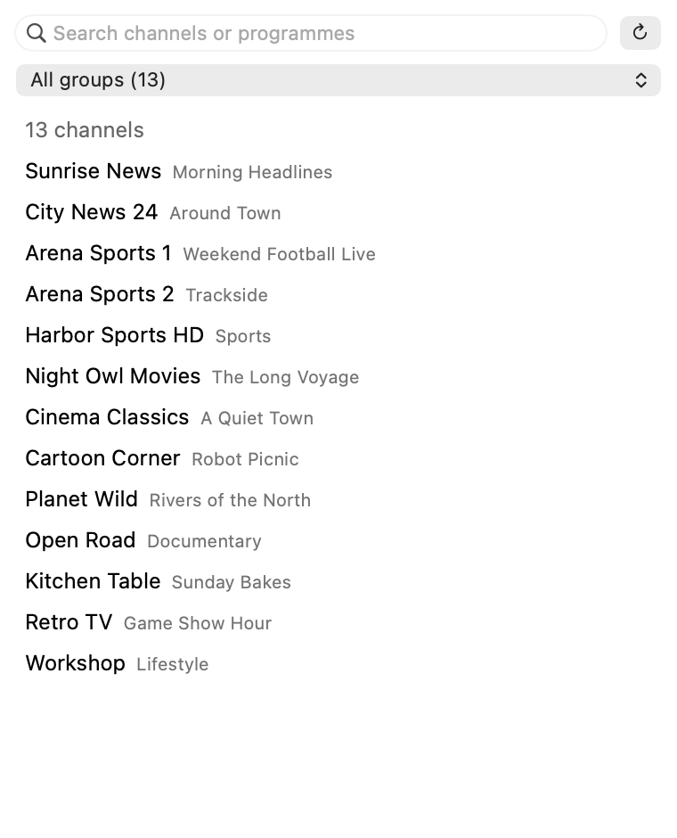

# Channels: IPTV for IINA

An [IINA](https://iina.io) plugin that turns an M3U playlist into a channel
browser, with search, groups and a now/next guide.



*The channel list, shown with sample data.*

## What it does

- Lists the channels from an M3U playlist, in the player sidebar or in its own
  window, so you can browse before anything is playing.
- Searches by channel name or by what is on right now.
- Filters by the playlist's groups.
- Shows the programme on now next to each channel, read from the XMLTV guide
  the playlist advertises (`url-tvg`). Hover a channel for the time slot,
  what's next and the description.
- Titles the player window with the channel name instead of the stream's
  file name.

## Install

1. In IINA, open Settings → Plugins and install from GitHub:
   `DTTerastar/iina-plugin-channels`
2. Open the plugin's settings and paste your M3U playlist URL.
3. Restart IINA.

## Use

- **Plugin → Show Channel List** opens the list in its own window.
- In a player window, **Plugin → Show Plugins Panel**, then pick **Channels**.

Click a channel to play it. The ↻ button reloads the playlist and guide.

## Permissions

IINA shows these when you install the plugin. This is why each is there:

| Permission | Why |
| --- | --- |
| Network, all domains | IINA requires it before a plugin may open an `http(s)` stream, and stream hosts differ per provider. |
| File system | IINA requires it before a plugin may set a stream's title or run a helper. The plugin runs `/usr/bin/curl` to download the playlist and guide; it does not read or write files. |
| Show OSD | Flashes the channel name when you tune. |

## Limits

- The list shows 300 rows at a time. Search or pick a group to see the rest.
- Guide data must be plain XMLTV (not gzipped), and a channel needs a
  `tvg-id` that matches the guide.
- After updating the plugin, quit and reopen IINA. The sidebar list stays blank
  until you do.
- **Plugin → Reload All Plugins** crashes IINA 1.5.0 while a plugin with a
  sidebar is loaded. Quit and reopen IINA instead.
- Tested with one playlist, served by [Tuliprox](https://github.com/euzu/tuliprox),
  on IINA 1.5.0 and macOS 27.

## Development

No build step.

```sh
git clone https://github.com/DTTerastar/iina-plugin-channels
/Applications/IINA.app/Contents/MacOS/iina-plugin link iina-plugin-channels
node iina-plugin-channels/m3u.js   # parser self-check, prints "ok"
```

Restart IINA after changing `main.js` or `Info.json`.

## License

MIT
